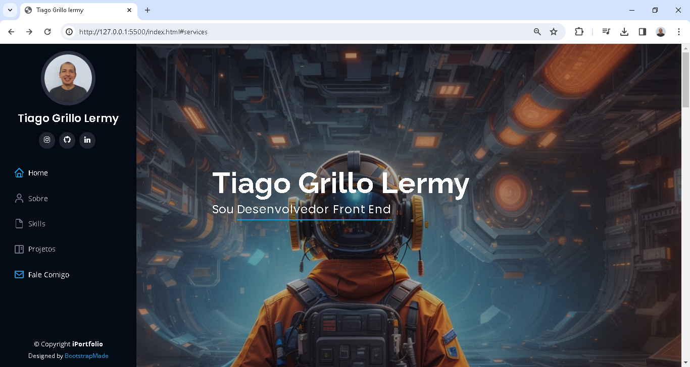

# Portfolio de Desenvolvimento FrontEnd

Este repositório contém o código-fonte do meu projeto de portfólio desenvolvido como parte do curso de Desenvolvimento FrontEnd no curso de Análise e Desenvolvimento de Sistemas na faculdade Descomplica. A professora Lígia Gouvêa desempenhou um papel fundamental no auxílio e orientação durante o desenvolvimento deste projeto.

## Template Utilizado
- **Nome do Template:** iPortfolio
- **URL do Template:** [iPortfolio - BootstrapMade](https://bootstrapmade.com/iportfolio-bootstrap-portfolio-websites-template/)
- **Autor:** BootstrapMade.com
- **Licença:** [Licença do Template](https://bootstrapmade.com/license/)

## Tecnologias Utilizadas
- HTML
- CSS
- JavaScript
- Bootstrap

## GitHub Pages
Este projeto está disponível no GitHub Pages. Confira [aqui](colocar-o-link-do-github-pages) para visualizar o portfólio online.

## Sobre o Projeto
Este projeto foi desenvolvido como parte do aprendizado na disciplina de Desenvolvimento FrontEnd. Utilizando as tecnologias mencionadas acima, o objetivo foi criar um portfólio online para destacar minhas habilidades e projetos.

## Imagem do Projeto
<div align=center">

</div>

## Como Utilizar
1. Clone este repositório:
   ```bash
   git clone https://github.com/seu-usuario/nome-do-repositorio.git
   ```
2. Abra o arquivo `index.html` no seu navegador para visualizar o portfólio.

## Contribuições
Contribuições são bem-vindas! Sinta-se à vontade para abrir issues ou pull requests para melhorias.

## Contato
Em caso de dúvidas ou sugestões, entre em contato comigo por meio do meu e-mail: tlermy@gmail.com.

---

**Agradecimentos especiais à professora Lígia Gouvêa e ao BootstrapMade.com pelo excelente template utilizado neste projeto.**

